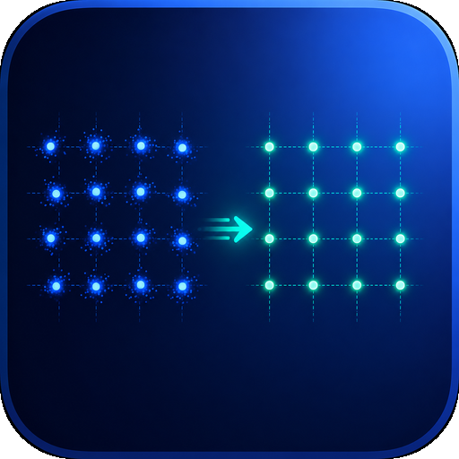

<p align="center">
  
</p>

<h1 align="center">WiFi 7 PA + DPD AI 辅助研发工程</h1>

<p align="center">
  
</p>

面向 RFIC/Analog IC 团队的 WiFi 7(802.11be)功率放大器(PA)+ 数字预失真(DPD)研发框架,覆盖:

```
CMOS/SOI PA 设计 → 电路仿真(Spectre)→ 行为建模(GMP baseline / 神经网络)
     → DPD(ILA / Neural)→ FPGA/ASIC 部署 → WiFi 系统验证(EVM/ACLR/Mask)
```

**Phase 1**:可运行的 Python 基线框架 —— 802.11be 风格 OFDM 波形、经典 PA 行为模型(Saleh/MP/GMP)、ILA-GMP DPD、CFR 削峰、完整系统指标(EVM/ACLR/频谱 Mask/AM-AM/AM-PM/CCDF),模型持久化,CI,用合成数据端到端跑通。
**Phase 1.5**:以 [OpenDPD](https://github.com/lab-emi/OpenDPD) 为参照完成整体检视 —— 其数据集格式、指标口径、~500 参数基准配置全部纳入,并在三套真实 PA 测量数据上复现其经典 baseline。
**Phase 2**:PyTorch 神经建模(`padpd.nn`,可选依赖)—— GRU/DGRU PA 行为模型、DLA 神经 DPD,在真实数据上完成训练与对标;**神经代理使 APA 的 DPD ACLR 读数与 OpenDPD 发表值逐位吻合**(-38.53 vs -38.80),详见 `docs/04_neural.md`。

## 快速开始

```bash
pip install -e .          # 安装 padpd 包(依赖 numpy/scipy/matplotlib)
pytest tests/             # 运行全部单元测试(200+ 项;-m "not slow" 跳过长训练)
python scripts/run_baseline_demo.py       # 合成数据端到端 demo
python scripts/generate_dataset.py        # 生成合成 PA 数据集(.npz)

# 真实测量数据 baseline(需先 clone OpenDPD,约 55 MB 数据)
git clone --depth 1 https://github.com/lab-emi/OpenDPD.git ../OpenDPD
python scripts/run_opendpd_baseline.py --opendpd-root ../OpenDPD
```

### 合成数据 demo(160 MHz / 1024-QAM / 虚拟 ReferencePA)

| 指标 | 无 DPD | ILA-GMP DPD |
|------|--------|-------------|
| EVM(星座域) | -19.0 dB | **-57.4 dB** |
| ACLR(上邻道) | -31.1 dBc | **-54.8 dBc** |
| 发射 Mask | FAIL | **PASS** |

GMP 行为模型验证集 NMSE:**-57.8 dB**(52 系数),优于 Memory Polynomial 的 -52.2 dB。

深压缩工作点(`--drive 0.18 --cfr-papr 8`,CFR + DPD 组合):

| 链路 | EVM | ACLR(上邻道) | Mask |
|------|-----|--------------|------|
| DPD(无 CFR,峰值不可逆) | -27.7 dB | -31.7 dBc | FAIL |
| **CFR(8 dB)+ DPD** | **-36.9 dB** | **-56.3 dBc** | **PASS** |

拟合好的模型/DPD 可持久化复用:`model.save("gmp.npz")` → `padpd.pa.load_model(...)`;`dpd.save(...)` → `ILAPredistorter.load(...)`。

### 真实测量数据 baseline(OpenDPD 数据集,OpenDPD 指标口径)

PA 行为建模(测试集 NMSE,~500 实参数):

| 数据集 | MP-500 | GMP-510 |
|--------|--------|---------|
| DPA_200MHz | -35.0 dB | -33.7 dB |
| DPA_160MHz | -38.3 dB | **-39.2 dB** |
| APA_200MHz | -37.1 dB | -35.5 dB |

数据驱动 ILA-GMP-510 DPD(代理评估):

| 数据集 | DPD 后 ACLR / EVM(谱) | OpenDPD 发表 GMP-QR |
|--------|----------------------|--------------------|
| DPA_160MHz | **-52.8 / -54.0** | -54.0 / -51.1 |
| APA_200MHz | -26.2* / **-38.4** | -38.8 / -38.5 |

\* Phase 1.5 时受 GMP 评估代理限制;**Phase 2 用神经 DGRU 代理重评同一 DPD 后 ACLR 为 -38.53 dBc**,与发表值 -38.80 几乎逐位吻合(`scripts/rerun_apa_surrogate.py`)。结论:多项式代理带外外推不可信,DPD 代理评估必须用神经代理。

### 神经建模(Phase 2 / 2.5,`pip install -e .[nn]`)

| 结果 | 数值 |
|------|------|
| **TCN-H16 PA 模型(DPA_200MHz,464 参数)** | NMSE **-34.9 dB → 超过 GMP-510 的 -33.7**(ASIC 友好) |
| **DLA 神经 DPD(DPA_160MHz,486 参数)** | ACLR -34.5 → **-53.1 dBc**,越过 -52 验收线(发表 GRU -51.9) |
| DLA 神经 DPD(DPA_200MHz) | ACLR -30.6 → **-49.5 dBc** |
| APA 代理重评(F=200 神经代理) | 同一经典 DPD:ACLR **-38.56**,与发表 -38.80 吻合 |

三个 GRU/DGRU/TCN backbone、DLA 直接学习、真实数据训练;训练命令与完整分析见 `docs/04_neural.md`。APA_200MHz 的 -43.5 dB PA NMSE 经系统排查判定为公开信息无法复现(不影响 DPD 结论)。

## 图形界面(GUI)

完整功能均可通过 GUI 使用(分析、结果比较、图形化仿真结果、输入/输出
文件)。两个版本功能同构,共享同一服务层与实验注册表。
**注意**:PyPI 发行包只含 `padpd` 核心库;GUI(`gui/`、`gui_qt/`、
`gui_core/`)需 clone 本仓库使用,`[gui]`/`[gui-qt]` extras 只安装其
第三方依赖:

```bash
# 方案 A:Web 工作台(Streamlit + Plotly,团队共享/远程)
pip install -e .[gui]
streamlit run gui/app.py

# 方案 B:桌面版(PySide6,可打包 Windows exe)
pip install -e .[gui-qt]
python -m gui_qt.main
```

8 个功能页:总览 / 波形工作台(PSD·CCDF·星座·CFR·导出)/ 数据管理
(OpenDPD·Cadence CSV·.mat·.npz,自动对齐)/ PA 建模(经典 LS + 神经
带进度)/ DPD 实验室(ILA/DLA,前后指标与图)/ 结果比较 / 部署(位宽
扫描·ONNX·系数导出)/ PA-DPD 联合设计 / **内置双语图文用户手册**
(`manual/`,8 章,整合全部文档,随界面语言切换)。两版均支持
**中/英文切换**与**深色/浅色主题切换**(侧栏底部,偏好持久化且两版
共享)。exe 打包见 `packaging/README_packaging.md`,导览见
`docs/06_gui.md`。

## 仓库结构

```
docs/                    # 中文文档
  00_overview.md         #   总体研发流程(AI 增强流程全景)
  01_environment_setup.md#   研发环境搭建清单(软件/开源工具链/数据集/GPU/EDA 接口)
  02_data_interface.md   #   数据接口规范(Cadence CSV / MATLAB .mat / OpenDPD)
  03_roadmap.md          #   分阶段路线图(Phase 1~4)
  04_neural.md           #   神经建模(架构/训练/DLA/实测数字)
  05_performance_summary.md #  性能总览(Phase 1→2.5 全部指标一页汇总)
  06_gui.md              #   GUI 导览(Web 版 + 桌面版 + exe 打包)
src/padpd/               # Python 包(代码与注释为英文)
  waveform/              #   802.11be 风格 OFDM + 16~4096-QAM
  pa/                    #   PA 行为模型:Saleh / MP / GMP / ReferencePA
  │                      #   + presets.py(OpenDPD ~500 参数基准配置)
  dpd/                   #   ILA DPD(闭环迭代 fit / 数据驱动 fit_measured)
  metrics/               #   星座 EVM / ACLR / PSD+Mask / AM-AM & AM-PM
  │                      #   + opendpd_compat.py(OpenDPD 论文口径)
  data/                  #   IQDataset + Cadence/MATLAB/OpenDPD 加载器
  │                      #   + align.py(整数+分数延迟对齐)
  cfr.py                 #   CFR 削峰(迭代削峰滤波,DPD 前级)
  loopback.py            #   环回观测通路损伤模型(DPD 预算研究)
  two_tone.py            #   双音记忆诊断 → DPD 资源预判(流片前定规模)
  pa/hb_import.py        #   HB/S21 导入 → Wiener-Hammerstein(流片前预判)
  pa/spline.py           #   分段样条模型(SMP/SplineGMP,B 样条基 + 节点放置)
  pa/spline_state.py     #   状态条件化样条(慢功率状态)+ 工况系数调度器
  pa/thermal.py          #   自热虚拟 DUT(耗散功率→RC 热网络→漂移)
  pa/drift.py            #   时变 PA(温漂/老化跟踪研究)
  dpd/adaptive.py        #   自适应/在线 DPD(块 RLS,跟踪 PA 漂移)
  deploy/qat.py          #   量化感知训练(fake-quant + 直通估计)
  deploy/lut.py          #   LUT 提取(样条→插值表)+ LUTDPD 运行时孪生
  deploy/rtl.py          #   RTL 生成器(Verilog DPD MAC / LUT 寻址+插值,bit-true 验证)
  codesign.py            #   Phase 4 PA/DPD 联合设计权衡研究
  deploy/                #   Phase 3 部署:bit-true 量化 + 神经 PTQ +
  │                      #     ONNX/定点系数/参考向量导出(FPGA 交接)
  plotting.py            #   标准对比图(PSD/星座/AM-AM/CCDF)
manual/                  # 内置双语用户手册(zh/en 各 8 章 + 截图资产)
gui_core/                # GUI 共享服务层(框架无关:计算服务 + 实验注册表)
gui/                     # Web 工作台(Streamlit + Plotly,8 页)
gui_qt/                  # 桌面版(PySide6 + matplotlib,8 页,QSS 深色主题)
packaging/               # PyInstaller 打包(spec / Windows bat / 说明)
scripts/                 # 合成 demo / 数据集生成 / OpenDPD 真实数据 baseline
examples/                # 可直接 load 的输入范例(双音 IM3 表等)
tests/                   # pytest 单元测试(含与 OpenDPD 原版指标的数值等价测试)
```

## 设计原则

1. **GMP 是黄金 baseline**:后续所有神经网络模型(GRU/LSTM/Transformer)必须与 GMP 在同一数据、同一指标下对比。
2. **统一模型接口**:所有 PA/DPD 模型实现 `fit(x, y)` / `__call__(x)`,神经模型可直接替换经典模型。
3. **数据源可替换**:`ReferencePA` 是晶体管级仿真的占位,换成 Cadence Envelope 导出数据后下游代码零改动(见 `docs/02_data_interface.md`)。
4. **指标口径分明**:工程验收用 padpd 原生星座 EVM / 802.11 风格 ACLR;与 OpenDPD 论文横向对比用 `opendpd_compat` 口径(两者数值不可混比)。

## 路线图

- **Phase 1**:经典 baseline 全链路(Saleh/MP/GMP/DDR、ILA、CFR、指标)✅
- **Phase 1.5**:OpenDPD 对标检视与补齐(真实数据 baseline)✅
- **Phase 2 / 2.5**:神经 PA 建模(GRU/DGRU/TCN)+ DLA Neural DPD;TCN 超 GMP ✅
- **Phase 3**:定点部署(线性 + 神经 PTQ)+ ONNX/系数/参考向量导出 ✅
- **Phase 4**:PA/DPD 联合设计(离散 Pareto + 可微梯度寻优)✅(Spectre 回环需 EDA)
- **GUI**:双版本图形界面(Streamlit Web 工作台 + PySide6 桌面版/exe 打包)✅
- **Phase 5**:现场硬化与硅前/硅后落地 ✅ —— 自适应 RLS DPD(跟踪 PA 漂移,
  满漂移领先冻结 DPD 10.4 dB EVM)、物理漏极效率、QAT、**RTL 生成器
  (可综合 Verilog DPD MAC,iverilog 逐位验证 0 错误)**、跨平台 CI + PyPI、
  **双音记忆诊断**(多 delta-f 双音粗判记忆强度 → 预判 DPD 记忆规模,
  流片前用便宜表征定档,系数留给实测)
- **Phase 6**:分段样条 + LUT DPD ✅ —— B 样条 SMP/SplineGMP(条件数比
  高阶多项式低 100 倍,运行时每分支仅 4 次有效 MAC)、P 样条平滑/WLS
  估计、状态条件化样条(自热虚拟 DUT 上比纯 SMP 改善 ~10 dB)、跨工况
  系数调度器、LUT 提取 + 表深/位宽双轴扫描、**LUT 寻址+线性插值 RTL
  (iverilog 逐位验证 0 错误)**,手册 §5.9
- **Phase 6.5**:TX/RX 前端损伤全链路 ✅ —— widely-linear 共轭分支
  (镜像,DPD +22.3 dB)、conj³ 相位谐波分支(C-IM3 建模 +14.5 dB,
  含 LUT/RTL 部署与 DSP 结构天花板实证)、增益调制时常数辨识
  (阶跃响应表征 → 状态样条配置)、**QMC 专用抵消环**(镜像/LO 泄漏
  精确预逆,三轮 -88.5 dBc,DPD 系数减半)、**观测路径去嵌**
  (时延/CFO/相位漂移/RX IQ 逐级反演:不去嵌自适应失效 +3.6 dB →
  去嵌后 -48.4 dB,距干净参考 ~5 dB;旁路标定逆 FIR 均衡 + 衰减
  步进 RX-IM3 标定补齐盲估不可辨识项)、**三环联合系统实验**
  (QMC + 去嵌 + 自适应 DPD 在漂移 PA 上同时闭环:原始环回 +33 dB
  失效 / 仅去嵌钉在 IRR -29 / 三环 -35.1 dB,镜像持续 <-60 dBc,
  双 GUI 面板一键复现)、**完整实测源容器**(单 npz 承载 突发/阶跃
  探针/旁路标定/衰减步进/多工况 五个采集组,各解锁一类能力;离线 τ
  辨识 + 一键消费工具 + 示例文件,数据页显示完整度清单),手册
  §5.9 与第 4 章

全部指标汇总见 `docs/05_performance_summary.md`,分阶段细节见 `docs/03_roadmap.md`。
一页式速览(自包含 HTML,clone 后浏览器直接打开):
[PA 建模框图](docs/pages/modeling-blockdiagram.html)(机制 ↔ 分支一一映射)、
[DPD 侧框图](docs/pages/dpd-blockdiagram.html)(三环分工与闭合)、
[实测数据接口指南](docs/pages/measured-data-guide.html)(采集清单 → npz 容器 →
Spectre/台架流程 → 导入验证)。
本环境(4 核 CPU、无 GPU)已完成可做部分;仍需硬件/EDA(FPGA 上板、SDR
台架、Spectre 回环)的项目接口均已就绪,可用现有脚本推进。
