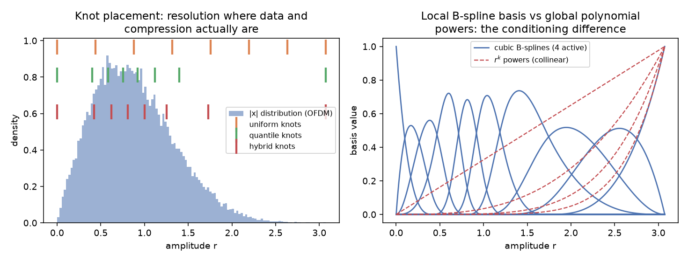

# 5. 模型与算法速览

面向使用者的最小必要背景:每个模型/算法是什么、何时选它。推导与
实现细节见 `docs/00_overview.md` 与 `docs/04_neural.md`。

## 5.1 经典 PA 行为模型(LS 闭式解)

| 模型 | 特点 | 适用 |
|---|---|---|
| Saleh | 无记忆 AM-AM/AM-PM 解析式 | 教学、粗略仿真 |
| Memory Polynomial (MP) | 对角 Volterra,阶数×记忆 | 快速基线 |
| GMP | MP + 交叉滞后/超前项 | **黄金基线**,精度/成本均衡 |
| DDR-Volterra | 动态偏差约减,r 阶截断 | **DPD 基函数首选**(见 5.4) |

三个 OpenDPD 对标 preset:MP-500、GMP-510、DDR-140(数字为实参数量)。

**重要**:这类线性参数模型必须用最小二乘闭式解拟合,不要用 SGD——
同一 GMP 用 SGD 训练 ACLR 差 9 dB 以上(OpenDPD 与本工程双重实证)。
GUI 的"经典 (LS)"路径即闭式解。


## 5.2 神经 PA 模型(SGD 训练)

| backbone | 结构 | 特点 |
|---|---|---|
| GRU | 原始 IQ 序列输入 | 基线 RNN |
| DGRU | 6 通道特征(I,Q,幅度,幅度³,sin,cos)+ 前馈旁路 | OpenDPD 主力结构 |
| TCN | 逐点卷积 + 4 层空洞深度卷积(d=1/2/4/8) | 无递归,**定点/ASIC 最友好** |

实测数据上 TCN-H16(464 参数)NMSE -34.9 dB,首次超过 GMP-510 经典
基线;且量化鲁棒性远超多项式(见第 6 章)。

## 5.3 DPD 两条路线

- **ILA(间接学习)**:辨识 PA 的后逆(以 `y/G` 为输入、`x` 为目标做
  LS),把后逆搬到前级。经典、秒级、无需 torch。合成源可闭环迭代;
  实测数据用数据驱动版(`fit_measured`)。
- **DLA(直接学习)**:预失真器(神经)与**冻结的神经 PA 代理**级联,
  以 `G·x` 为目标端到端梯度训练。需要先拟合神经代理,但在真实 PA
  (多项式失效的 GaN 等)上显著更强。


## 5.4 三条经过实证的选型法则

1. **DPD 评估必须用神经代理**:多项式代理带外外推失真,ACLR 读数可差
   12 dB(APA 实测);全局 NMSE 高不代表 ACLR 可信。
2. **建模准 ≠ DPD 好**:DDR 正向建模只追平 GMP,但作 DPD 基函数用
   55% 参数全面超越(GaN 上领先 8.5 dB)。选基函数直接评 DPD 后指标。
3. **深压缩工作点先 CFR**:峰值进入 PA 不可逆区时 DPD 发散;CFR 用
   有界的 EVM 代价(削峰)换回可逆性,"CFR + DPD"才能 Mask PASS。

## 5.5 指标口径

| 口径 | 指标 | 用途 |
|---|---|---|
| padpd 原生 | 星座域 EVM(解调后)、802.11 风格 ACLR、发射 Mask | 工程验收 |
| OpenDPD 兼容 | 谱域 EVM、ACLR_AVG(nperseg 分段 Welch) | 与论文横向对标 |

两套口径数值**不可混比**;GUI 按数据源自动选择并在结果中标注。

## 5.6 流片前:从电路仿真到 PA+DPD 预判

PA 还没流片时,电路仿真已能提供初步建模所需的一切:

| 仿真 | 提取 | 用途 |
|---|---|---|
| 谐波平衡扫功率 | AM-AM/AM-PM 表 | 静态非线性 |
| S 参数 / PSS+PAC | 输入/输出匹配 S21 | 线性记忆(FIR) |
| 包络瞬态 | 输入/输出 IQ 对 | 直接按第 4 章 Cadence CSV 导入 |

`padpd.pa.load_hb_pa` 把 AM-AM/AM-PM 表 + S21 表装配成
Wiener-Hammerstein 模型(FIR → 查表非线性 → FIR,超表输入饱和):

```python
from padpd.pa import load_hb_pa
pa = load_hb_pa("hb_amam.csv", "s21_in.csv", "s21_out.csv",
                fs=320e6, drive=0.14)   # 标准 PAModel,即插即用
```

`scripts/import_hb_pa.py --demo` 生成示例 CSV 并跑通完整预测链——
demo 结果:GMP 拟合导入 PA 达 NMSE -43.7 dB;DPD 预测 EVM
-18.3 → **-48.1 dB**、Mask FAIL → PASS。扫 `--drive`(配合 CFR 与
联合设计)即可在流片前回答:**这颗 PA 配多大 DPD、退多少功率能过
spec**。建议同时做鲁棒性扫描(非线性强度/记忆深度扰动 ±20%)确认
结论不翻转。CSV 列约定见 `docs/02_data_interface.md` 第 8 节。

## 5.7 自适应/在线 DPD 与现场漂移

批处理 DPD 一次性辨识;产品形态需要从环回持续自适应以跟踪 PA 漂移
(温度/供电/老化)。`padpd.dpd.AdaptiveDPD` 用块 RLS 在 GMP/DDR 基上
递归更新:

```python
from padpd.dpd import AdaptiveDPD
dpd = AdaptiveDPD(forget=0.6)      # 默认 method="rls";forget 越小跟踪越快、越噪
# 中间档也可直接选:
#   AdaptiveDPD(method="whitened", mu=0.5)       # 摊销版 RLS(见下图)
#   AdaptiveDPD(method="apa", apa_k=4, mu=0.3)   # 仿射投影,K 可调
dpd.warm_start(pa, x, blocks=6)    # 从直通收敛
dpd.update(pa, x)                  # 每块从环回观测更新
```

**不单独提供普通 LMS/NLMS**:多项式基条件数约 1e10,只调尺度的梯度法
要么发散、要么原地打转——"线性参数模型必须用 LS 而非 SGD"在在线场景
的翻版。提供的三种方法(`rls`、`whitened`、`apa`)都用到协方差的非对角
项来跨过病态。

`scripts/run_lms_vs_rls.py` 在同一颗静态 PA、同一 GMP 基、同一直通
起点上并排跑几种在线估计器,把"介于 RLS 和 NLMS 之间"的中间档也
放到同一条轴上:


- **RLS**(O(N²)/样本):每块显式求逆协方差,收敛与条件数无关,**一个
  块**就到最小二乘底(EVM 稳态 ≈ −46 dB)并稳住;**最稳健**。
- **白化 NLMS**(O(N²)/样本,白化冻结):上电用暖机块的协方差做一次
  Cholesky 白化(O(N³)一次),之后在去相关坐标里跑 NLMS。**注意:施加
  稠密白化仍是 O(N²)/样本,与块 RLS 同阶、并不更省**(我之前写的
  "O(N)/样本"是错的)。它在**平稳**数据上能收得很低(图中 −65~−68,
  甚至低于 RLS 的 LS 底)——但这是自参照 ILA 迭代里逐样本近因加权更新
  收敛到更低不动点的产物,**属设定相关、不是普遍意义上比 RLS 更准**;
  且白化矩阵冻结,信号统计(波形/带宽/功率)一变就陈旧,RLS 每块重估
  协方差、更稳健。
- **APA(K=4,O(K²·N)/样本)**:在最近 K 个样本窗上去相关(小型 RLS),
  几块内爬到接近 RLS——**真正降低每样本成本**的中间档(K 小时),连续
  可调(K=1 即 NLMS,K 越大越靠近 RLS)。
- **NLMS**(O(N)/样本):活着但爬得慢、抖,停在比 RLS 高 6–12 dB 处
  (病态方向几乎不动)。
- **普通 LMS**(O(N)/样本):第一个块就发散到 NaN。

**关键点**:能跨过病态的方法,都用到了**协方差的非对角项**(白化 /
APA / RLS)。一个诚实的反例:**朴素对角预条件**(每列除以自己的功率)
在这个基上**也发散**——它把弱、共线的高阶列放大了。这里的杀手是列间
**相关**、不是尺度,只调尺度不去相关不管用。

**怎么选**:默认 **RLS**(最稳健;小 N 时 O(N²) 也几乎免费,可再配低
更新率)。要在**平稳信号**下压得更低、且算力预算够 → **白化 NLMS**。
**真要降每样本成本** → **APA(小 K)** 或变换域 LMS(DCT-LMS,固定快
变换,O(N log N))。大 N / 上硬件又要 RLS 精度 → **QR-RLS**(定点数值稳)。

`scripts/run_drift_study.py` 量化现场价值:PA 冷→热漂移中,冻结批处理
DPD 退化到 **-28.4 dB EVM**,自适应保持 **-38.8 dB**(满漂移领先
10.4 dB)。这回答了"DPD 在现场能不能扛住"。

**GUI 入口**:DPD 实验室页底部「🔁 自适应 / 在线 DPD(漂移跟踪)」可选
方法(rls / whitened / apa)、**带宽(20–320 MHz)**、块数、漂移强度、
forget 与 **APA 投影阶 K**,
一键跑出自适应 vs 冻结批处理的逐块 EVM 曲线;扫 K(1→8)即可现场看到
APA 从 NLMS 向 RLS 收敛。

## 5.8 双音记忆诊断:用两音扫间距预判 DPD 该留多少资源

单音 AM-AM/AM-PM 只给**静态**非线性,看不见记忆:同一条静态曲线既能
拟合无记忆 PA,也能拟合强动态 PA。而**双音扫音间距(delta-f)**恰好是
流片前电路仿真最容易给的大信号表征(谐波平衡跑几个音间距的 IM3),
所以它是从 Spectre 到"DPD 该多复杂"的天然桥梁。

思路不是逼双音交出完整记忆核,而是**用多个 delta-f 的 IM3 粗判记忆
强度**,据此决定 DPD 要预留多少记忆,再把系数训练交给实测数据。
`padpd.two_tone` 从 IM3 读两种正交的记忆信号:

- **随间距变化**(spacing spread):扫音间距即扫包络频率;IM3 随间距
  变化就说明有记忆(MHz 级间距 = 偏置/匹配电记忆,kHz 级 = 热记忆)。
  无记忆非线性的 IM3 与间距无关。
- **上下不对称**(asymmetry):无记忆非线性上下 IM3 严格相等;任何
  不对称都是记忆(复数/交叉项)信号,且向小间距增大指向热记忆。

两者取较大者浓缩为标量**记忆强度(dB)**——大致等于"静态模型无法
复现的那部分 IM3 有多少 dB"。`recommend_dpd_budget` 把它映射到粗略
DPD 规模:留多深的对角记忆、要不要 GMP 交叉项。

判断链路分三段——**测量 IM3 → 浓缩成三个判据 → 阈值梯度定档**:


- **测量**:双音扫多个音间距,读上/下边带 IM3(dBc)。无记忆 PA 上下
  相等且不随间距变,记忆打破这个对称。
- **三判据**:`spread = ptp(各间距平均 IM3)` 度量对角(对称)记忆;
  `asym = max|上−下|` 度量交叉(复数)记忆;不对称在最小间距处最大
  ⇒ 疑似热记忆;`记忆强度 = max(spread, asym)`。
- **定档**:`spread` 按 `<0.5/1.5/3/6` 档映射到记忆深度 `1/2/3/4/5`;
  `asym≥1 dB` 起加 GMP 交叉项(`≥4 dB` 加深);热记忆再挂一条慢包络
  LPF 支路;最后拼出 GMP 配方与估算系数量。阈值是拿闭环 DPD 扫描
  标定的启发式,给的是"预留下限",系数仍用实测训练。

```python
from padpd.two_tone import sweep_two_tone, recommend_dpd_budget
r = sweep_two_tone(pa, [0.5e6,1e6,2e6,5e6,10e6,20e6,40e6], fs=320e6)
b = recommend_dpd_budget(r)          # {'memory_depth':3,'use_cross_terms':True,...}
# 电路双音仿真结果也能直接喂:
from padpd.two_tone import memory_strength_from_table
r = memory_strength_from_table(spacings, im3_lower_dbc, im3_upper_dbc)
```

**GUI 入口**:数据管理页"〰️ 双音记忆诊断"标签可直接"载入示例"或上传
你的双音 IM3 表 CSV,即时看到记忆强度、建议记忆深度/交叉项/估算系数量、
IM3-音间距曲线与热记忆判断(示例
`examples/two_tone_example.csv` → 记忆强度 8.5 dB、深度 5、需交叉项、
疑似热记忆)。

`scripts/run_two_tone_study.py` 做了闭环验证:无记忆 Saleh 读出记忆
强度 **0.0 dB**(留 depth 1),强色散 PA 读出 **3.0 dB**(留 depth 3
+ 交叉项)。在强 PA 上用真实 802.11 信号扫 ILA-GMP 记忆深度,EVM 拐点
正好落在双音预判的 depth 3:无记忆 DPD 只到 -19.7 dB,depth 2/3 拿到
-27.9/-36.1 dB 的大头,再加深(depth 4/6 → -39.9/-41.5)收益递减。
即**流片前用便宜的双音就把 DPD 记忆量级定下来**,系数留给实测训练。

## 5.9 分段样条模型与 LUT DPD:从拟合到硬件表

MP/GMP 用全局幂次 |x|^k 描述包络非线性,幂列彼此高度相关(实测条件数
可到 1e7+),阶数一高就数值病态、峰值区外推失控。样条族改用**局部支撑
的 B 样条基**:每个基函数只覆盖相邻几个节点区间,任意幅度处只有
degree+1(三次为 4)个基非零。



**模型家族**(全部线性于系数,LS 一步解;`from_signal()` 自动依数据
放节点后即为固定节点,可持久化、可作 AdaptiveDPD 模板):

| 模型 | 结构 | 适用 |
|---|---|---|
| `SplineMemoryPolynomial` | x(n-m)·B_j(\|x(n-m)\|) | 默认样条基,SMP |
| `SplineGMP` | + 滞后/超前交叉包络分支 | 记忆不对称强的 PA |
| `StateConditionedSpline` | + 慢包络功率状态 q_k 与 (r,q) 二维面 | 热瞬态/长时记忆 |
| `CoefficientScheduler` | 系数随温度/偏置/功率标量插值 | 跨工况点调度 |

**节点放置**:`place_knots` 支持 uniform / quantile / hybrid(默认:
分位数铺主体 + 均匀铺 95% 以上尾部)——数据密处给分辨率,压缩膝与
峰值区保证有节点。**估计升级**:`fit(x, y, regularization=...,
smoothness=...(P 样条二阶差分惩罚), weights=...(WLS))`;
`basis_cond()` 可直接对比条件数(样条比 7 阶 MP 低 100 倍以上)。

**运行时与部署**——样条的核心卖点是它天然就是硬件 LUT:

1. `lut_from_model(model, n_entries)` 把每分支复增益采成均匀插值表,
   `LUTDPD` 是该数据通路的浮点孪生(逐分支 `np.interp` + 端点钳位);
2. 每样本每分支只需 1 次线性插值 + 1 次复乘(约 6 实数 MAC),与节点
   数无关;对照 GMP 的系数级 MAC(`spline_mac_cost` vs `mac_cost`);
3. `export_lut` 输出整数表项 JSON;`emit_lut_rtl` 生成 **LUT 寻址 +
   线性插值 + 延迟线 + 复数 MAC 的 Verilog**,自带测试台与整数 golden
   模型,`verify_with_iverilog` 位真验证(errors=0 才算过);
4. 位宽轴(`bitwidth_sweep`)与表深轴(`lut_sweep`)正交,部署页
   两个面板分别扫描。

**热/长时记忆**:`ThermalReferencePA` 是自热虚拟 DUT——耗散功率经
双极点 RC 网络驱动漂移状态,突发信号(`burst_stimulus`)下冷热增益
明显不同。纯 SMP 对它只能拟到平均曲线;`StateConditionedSpline` 补上
慢功率状态后 NMSE 改善约 8-11 dB(训练与留出突发都成立)。双音诊断
(§5.8)的预算输出现在同时给出 GMP 与样条两套配方
(`spline_config` / `spline_runtime_macs`)。

**镜像失真(widely-linear 分支)**:TX IQ 失衡把发送信号变成
`a·x + b·x*`,b 项(镜像)经 PA 后既线性通过又与主信号互调——**相位
等变的纯 x 基在结构上无法表示镜像**,建模/DPD 地板被钉死在镜像抑制比
(IRR)附近。`SplineMemoryPolynomial(conjugate=True)` 追加
`conj(x(n-m))·B_j(|x(n-m)|)` 共轭分支(仍线性于系数,与直通分支线性
无关,无需可辨识性修正);`IQImbalancePA` 是配套的 TX 失衡虚拟 DUT。
实测 0.3 dB/3°(IRR≈30 dB):纯 x 基 DPD EVM 只到 -30.5 dB,加共轭
分支后 **-52.8 dB(+22 dB)**。LUT 提取、JSON 导出与插值 RTL 均已带
共轭标记(硬件代价只是虚部一次取反),iverilog 位真验证通过。
